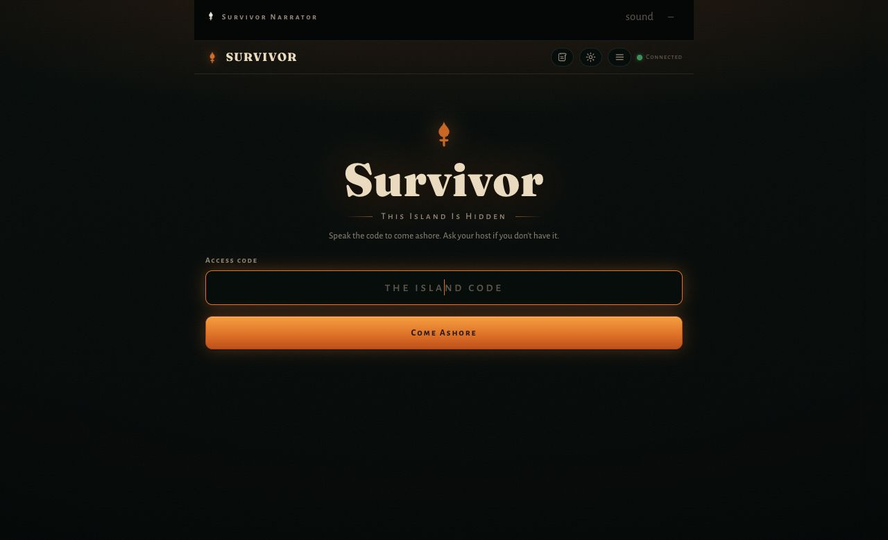
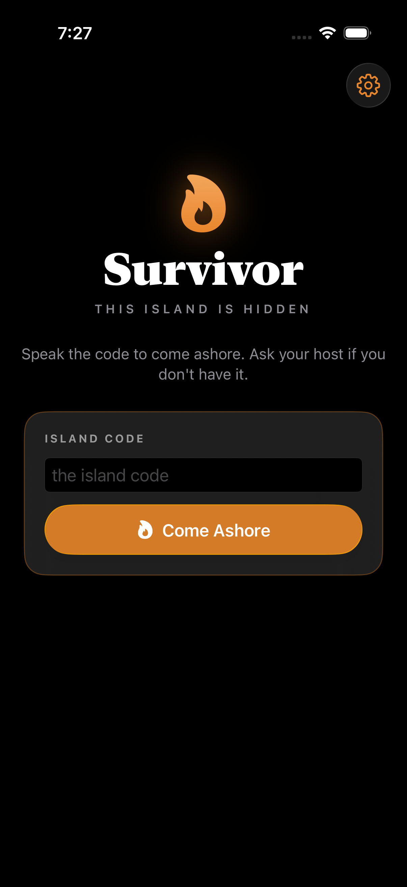
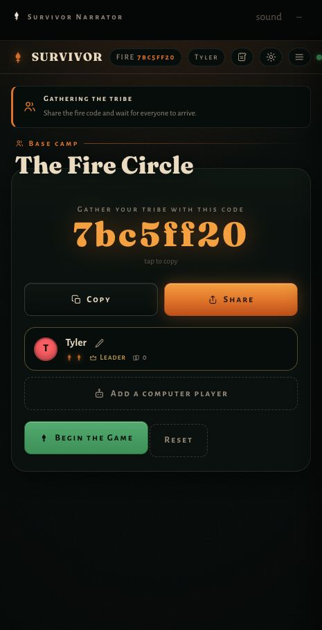
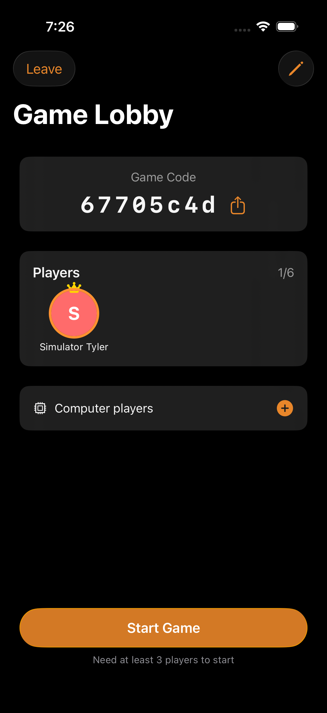

# Web-to-iOS port review

Reviewed and validated on 2026-07-31.

## Scope

The review covered the current web client (`client/dist/index-optimized.html`,
`styles.css`, `game.js`, and `ui.js`), the Flask/Socket.IO contract in
`survivor_server.py`, the native SwiftUI app, and the three most recent native
port commits:

- `c0a55d5` — project revival, model decoding, and phase 0–1 foundations
- `ab974d4` — native core loop and the first torchlit design pass
- `fa9a9c2` — broader web parity and the completed gameplay surface

Those commits established the game loop well, but the final parity commit did
not cover the deployment boundary around the island gate. The REST client,
Socket.IO client, server selection, and process-lifetime cookie behavior each
had a separate assumption. Together, those assumptions explain why a phone
could accept a code but still fail to enter or remain on the island.

## Findings resolved

| Finding | Impact | Resolution |
| --- | --- | --- |
| The app defaulted to one developer machine's `192.168.0.189:8080` address. | A phone away from that exact LAN could not reach the island. | The default and legacy migration now use `https://survivor.mctech.biz`; simulator/local overrides remain supported. |
| The settings server field did not actually rebuild the network client. | Editing the URL appeared to work but requests still used the old server. | Applying a server now saves the value, rebuilds the API client, restores the matching credential, and rechecks access. |
| The access code was buried in settings. | A locked deployment looked like a generic network failure. | A first-class native island gate now mirrors the web gate and clearly separates refused, locked, and unavailable states. |
| REST and Socket.IO used different sessions. | REST accepted the code while realtime lobby/game updates were rejected. | The shared REST cookie jar is imported explicitly and its cookies are supplied to Socket.IO's handshake. |
| The server cookie could race Foundation's jar propagation and could disappear across an immediate process relaunch. | A correct code worked inconsistently on device-style launches. | `Set-Cookie` is imported synchronously and the HttpOnly credential is copied to the app-private Keychain, then restored before the first access check. |
| A reconstructed local HTTP cookie included `Secure="FALSE"`. | Foundation interprets the presence of `Secure` as true, so the restored cookie was withheld from the simulator server. | The Secure property is now omitted for HTTP cookies and retained for production HTTPS cookies. |
| Join codes were forced to uppercase while server game IDs are lowercase hexadecimal. | Phone joins could report a missing game. | Join codes are trimmed and normalized to lowercase. |
| `/api/winners` was decoded as editable records even though it returns aggregates. | Hall of Fame loading could fail at runtime. | Aggregate and editable-record response shapes now have separate models and endpoints, with native add/edit/delete support. |

## Native parity added or completed

- Persistent player identity, preferred color, game defaults, and resumable
  game/player IDs.
- All eight web player colors.
- Working create, join, resume, lobby sharing/deep-linking, bot controls, and
  lobby settings.
- Native app settings for server, island access, identity, deck/rocks/pacing,
  confirmations, haptics, screen wake behavior, and story history length.
- Hall of Fame aggregate display plus record maintenance.
- Access-gate-aware navigation and 401 recovery throughout the game client.
- A dedicated UI-test target for code unlock, authenticated game creation,
  authenticated Socket.IO, process termination, credential restoration, game
  rejoin, and realtime reconnection.

## Visual review

The reference web journey was captured before implementation at a phone-sized
viewport and compared directly with the native states. The native app retains
the web product's black, ember-orange, warm serif, torchlit hierarchy while
using iOS controls, safe areas, keyboard behavior, share sheets, and settings
patterns.

### Access gate

| Web reference | Native iOS |
| --- | --- |
|  |  |

### Authenticated lobby

| Web reference | Native iOS |
| --- | --- |
|  |  |

Additional captured web states:

- [Start screen](01-web-start.png)
- [Join flow](02-web-join.png)
- [Playing state](04-web-playing.png)

## Validation evidence

- Xcode 26.3 (`17C519`), iPhone 17 Pro simulator, iOS 26.2 (`23C54`).
- End-to-end UI result:
  `/tmp/survivor-auth-cookie-reconstruction-20260731.xcresult` — **1 passed,
  0 failed**. This run entered the code, created and joined a game, asserted the
  Socket.IO state was `Connected`, terminated the app, relaunched it without
  the code, rejoined the lobby, and asserted Socket.IO reconnected.
- Native unit result:
  `/tmp/survivor-units-final-20260731.xcresult` — **58 tests passed,
  0 failed** (68 parameterized executions).
- The first aggregate Python/server run completed **21 of 24 suites**. The
  sandbox-blocked robustness suite passed **4 of 4** when run with permission,
  and the rules-enforcement suite passed after removing dependence on a random
  starting hand. The unchanged legacy browser checklist reached **33 of 39**;
  its remaining bot-turn timing assertions are recorded as existing browser
  harness debt rather than iOS regressions.
- `git diff --check` passes.

The requested Xcode MCP surface was not exposed to this Codex session. The same
checks were run with Xcode's supported command-line interfaces (`xcodebuild`,
`xcresulttool`, and `simctl`) and CoreSimulator instead. Documentation was
verified against Apple's current sources for URLSession cookie storage,
running tests, simulator/device execution, local-network privacy, onboarding,
and accessibility.

Official references:

- [URLSession cookie storage](https://developer.apple.com/documentation/foundation/urlsessionconfiguration/httpcookiestorage)
- [Running tests and interpreting results](https://developer.apple.com/documentation/xcode/running-tests-and-interpreting-results)
- [Running on simulated or physical devices](https://developer.apple.com/documentation/xcode/running-your-app-on-simulated-or-physical-devices)
- [Local network privacy](https://developer.apple.com/documentation/technotes/tn3179-understanding-local-network-privacy)
- [Onboarding](https://developer.apple.com/design/human-interface-guidelines/onboarding)
- [Accessibility](https://developer.apple.com/design/human-interface-guidelines/accessibility)

## Result

The native app now reaches the same server contract and core journey as the
web app, including the previously broken code-locked deployment path. The
remaining release check outside this workspace is a smoke test on the owner's
physical iPhone against the live HTTPS island.
